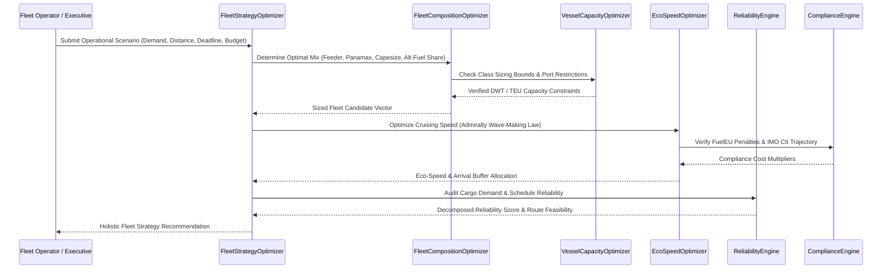

# SIH26138: Multi-Tier Green Fleet Optimization Workflow

**Problem ID:** SIH26138 — Quantum-Inspired Fuel Consumption Prediction & Green Fleet Optimization  

---

## 1. Co-Optimization Pipeline

Rather than optimizing fleet mix, ship sizing, and sailing speed independently, the platform executes a **unified multi-tier co-optimization**:

---

## 2. Objective Function Formulation

The co-optimization minimizes composite multi-criteria cost:

$$\min_{x} J(x) = w_{\text{cost}} \cdot \frac{C(x)}{C_0} + w_{\text{fuel}} \cdot \frac{F(x)}{F_0} + w_{\text{emiss}} \cdot \frac{E(x)}{E_0} + \mathcal{P}_{\text{penalties}}(x)$$

where:
- $C(x) = \text{Capex} + \text{Charter} + \text{Bunker Cost} + \text{Carbon Tax} + \text{FuelEU Penalties} + \text{Demurrage}$
- $F(x) = \sum_{v} \Delta_v^{2/3} V_v^3 \cdot \frac{D_v}{24 V_v \cdot C_{\text{adm}}}$
- $E(x) = \text{WTW Lifecycle CO}_2\text{e Emissions}$
- $\mathcal{P}_{\text{penalties}}(x)$: Severe quadratic barrier penalties for capacity shortfall, missed delivery deadlines, or budget violations.
