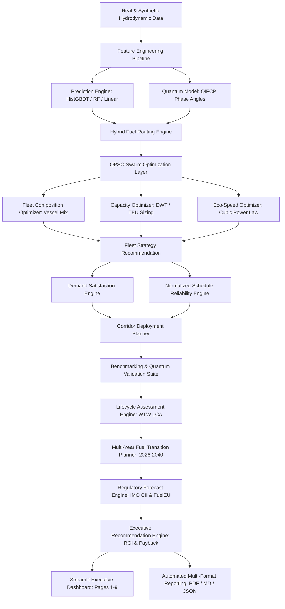

# SIH26138: System Architecture & Data Flow

**Problem ID:** SIH26138 — Quantum-Inspired Fuel Consumption Prediction & Green Fleet Optimization  
**Platform:** Quantum-Inspired Green Fleet Management & Decarbonization Intelligence Platform  

---

## 1. High-Level System Architecture

---

## 2. Component Layering

| Layer | Primary Responsibilities | Key Modules |
|:---|:---|:---|
| **Data Ingestion & Contracts** | Standardized voyage telemetry schemas, data validation, leak prevention | `contracts/schemas.py`, `src/ingestion/` |
| **Prediction & Quantum Modeling** | Hydrodynamic fuel burn estimation, wave resistance, QIFCP phase embeddings | `src/prediction/`, `src/physics/` |
| **Swarm Optimization** | Mixed-integer vessel counts, continuous speed, alternative fuel allocations | `src/optimization/` |
| **Operational Reliability** | Cargo demand satisfaction, schedule delay buffers, corridor allocations | `src/operations/` |
| **Scientific Benchmarking** | QPSO vs PSO/GA/SA/LP/Greedy, 30-seed Monte Carlo, Pareto frontiers | `src/benchmarking/` |
| **Lifecycle Assessment (LCA)** | Well-to-Wake (WTT + TTW) profiles across Grey/Blue/Green/Bio/E-fuels | `src/lifecycle/` |
| **Strategy & Regulatory** | 2026-2040 transition roadmaps, statutory MEPC.400(83) & FuelEU 2023/1805 | `src/strategy/` |
| **Decision Support** | Capital ROI, simple payback period, priority actions, risk mitigation | `src/decision_support/` |
| **Executive Presentation** | Interactive Streamlit executive suite, automated ReportLab PDF reports | `app/dashboard/`, `src/reporting/` |
